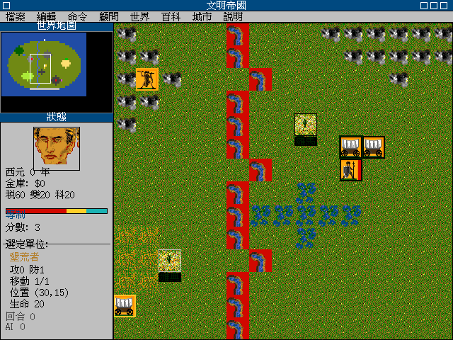
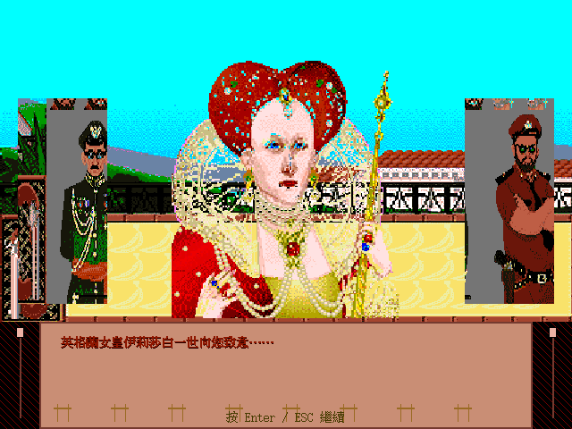
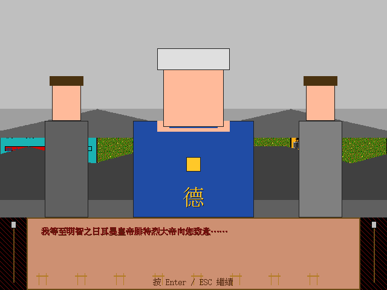
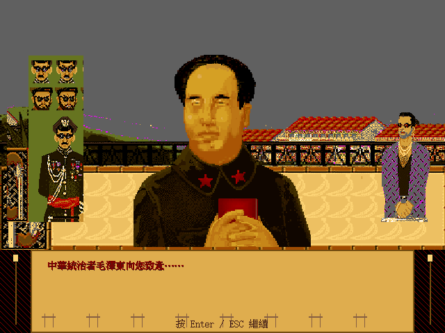
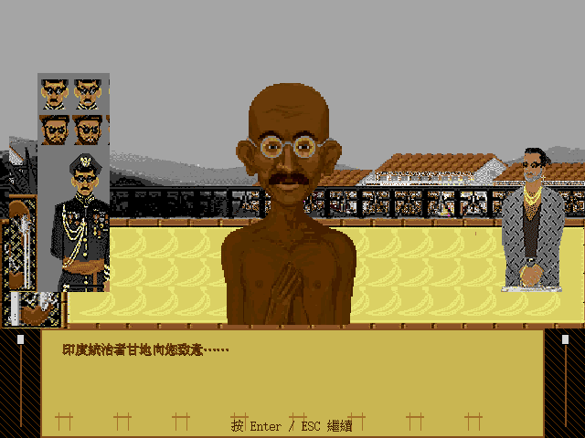
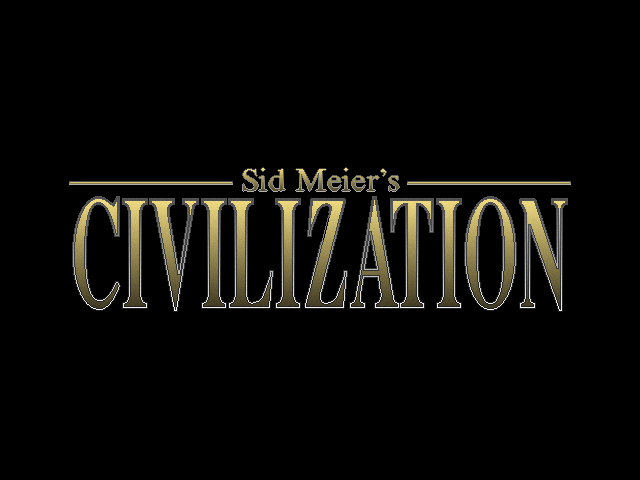

# civ1-decomplie-cht

> 對 **1993 MicroProse《文明帝國 視窗版》**（Win16 NE `CIV.EXE`）做 clean-room 反組譯，重寫成可攜的 **C99 + SDL2**，並內建繁體中文化。

不 patch 原版 binary，不依賴 [OpenCiv1](https://codeberg.org/rhorvat/OpenCiv1)（規格資料除外），全部 UI 改用 SDL2 + FreeType 重新組起。原始遊戲資產（CvPc sprite / palette / STR# 文字 / 14 KING 領袖肖像）仍從合法擁有的 `CIV.EXE` + `CIVDATA*.RSC` 載入，玩家必須自備拷貝。

---

## Showcase（2026-06-07 R26+R27 ship）

主畫面 — 純粹用 SDL2 重畫的 Win16 chrome、繁中 menu/title、minimap、status panel；右側 status panel 已接上 **R27-A 即時分數欄位**與**透明 Caesar 國家狀態縮圖**。



外交訪問畫面 — 載入原版 KING* sprite + GOVT*M 大 sheet 切 advisor/parchment/spear，套上各領袖自己的 palette 後 identity blit，色彩 100% 對齊 1993 原版。R27-fix 改用 corner + top-row sampling 解 magenta/cyan 透明邊，比 R25「只 skip palette idx 0」保留更多原色細節。

| 伊莉莎白一世（英格蘭） | 腓特烈大帝（日耳曼） |
|---|---|
|  |  |
| **毛澤東（中國）** | **甘地（印度）** |
|  |  |

CIV 開場 title splash — `CIVDATA1` id 136（502×145 原版 GIF）居中 blit，作為 intro sequence 起手第一幀。



---

## 最新貢獻（2026-06-07 R26+R27 ship）

玩家現在打開新局看得到的東西：

- **右側 status panel 直接顯示「分數: N」**，公式對齊 manual P23 / spec 09 §9.3：`2×happy + 1×content + 20×wonders + 3×peace + 10×future − 10×pollution + space + conquest`。v0.1 接通 content / peace / wonders / future 四因子，其餘待結構擴。
- **status panel 國家狀態縮圖透明邊乾淨**：4 角 + top-row sampling 推導 sentinel pixel index，不會再露 magenta/cyan 方塊。
- **新局精靈多一頁政府選擇 `PAGE_GOVERNMENT`**：5 種開局政府（Despotism / Monarchy / Communism / Republic / Democracy，排除 Anarchy 過渡期），選完直接寫進 `world.player_government` 並決定外交場景背景 sheet。
- **完整 47+5 科技樹**：tech enum 從 13 補到 72（67 核心 + 5 future），prereq DAG 對齊 spec 06 §6.5.1 + manual ground-truth，附 zh-TW 名稱與 reverse DAG（「這個科技解鎖了哪些奇蹟」）。
- **22 個世界奇蹟完整 enum**：cost / prereq / obsolete-by 對齊 spec 06 §6.2.4，分離出 `city.wonders_bitmap` 跟 `city.buildings_bitmap`，分數公式可以正確 popcount 已建奇蹟。
- **4 國領袖外交肖像 100% 原版色彩**：Elizabeth / Frederick / Mao / Gandhi 全部視覺驗證；KING* sprite 順序 ≠ STR# 140 slot 順序，靠 14 sprite 視覺辨識 dump 出 `SLOT_TO_KING_IDX` lookup table 校正。
- **GOVT*M backdrop 動態依政府型態切換**：Despotism/Monarchy/Anarchy → `GOVT0M`、Communism/Republic → `GOVT1M`、Democracy → `GOVT2M`。

全程 `ctest` 20/20 PASS、build 41/41 zero warning。

---

## 我們做了什麼

這專案的核心是把一個 1993 年的 Win16 老遊戲在不碰原始 binary 的前提下，靠 Ghidra 反組譯出規格、再用 C99 + SDL2 從零搭一個可在現代 Linux/Windows 跑、且**內建繁體中文化**的版本。

**Clean-room 雙隊制度**。Team A 只能開 Ghidra 看 `CIV.EXE` 並寫 markdown 規格；Team B 只能讀 markdown 規格寫 C99 + SDL2 程式碼。兩邊嚴格隔離，避免反組譯 output 直接 paste 進實作 source tree。詳見 [`docs/CLEAN_ROOM.md`](docs/CLEAN_ROOM.md)。

**繁體中文化**全鏈路落地。`CIVFONTS.FON` 我們不解（clean-room 自畫），改由 FreeType MONO 在 palette framebuffer 層合成 16×16 內文與 24×24 標題字模，UTF-8 walker + CJK glyph cache 接 STR# 文字表。`title bar`「文明帝國」、8 個 menu items（檔案/編輯/命令/顧問/世界/百科/城市/說明）、status panel 全欄位、city screen、tech discovery modal、diplomat 對話文字全部走同一條 i18n 路徑，目前翻譯進度 376/731 條（22/33 表覆蓋, 52%）。

**原版 KING / GOVT sprite hookup**。1993 Win 版實質是 1991 DOS 的 Mac port（內含 `mac.c` + `resmgr.c` Memory/Resource Manager shim），所有資產存在 5 個 Mac Resource Fork（CIVDATA0..4 + CIVHELP），由 spec 03 完整定義的 CvPc 格式（含 1991 LZW 變體）解碼。14 個 KING 領袖肖像 + 3 個 GOVT*M 大 sheet 是 R19→R21 的主軸：先發現 KING* sprite 順序 ≠ STR# 140 slot 順序、再發現 advisor / parchment / spear ornament 全擠在 `GOVT0M/1M/2M`（939×320）大 sheet 左右兩半，切片接上後 diplomat 場景的構圖完全對得上 1993 原版的 reference webp。

**透明度演算法心得**。Civ1 的 magenta / cyan sentinel 是個雷區：R21 一開始 RGB scan 整張 palette 找 magenta entries 標 skip，結果把 Elizabeth 紅裙的近 magenta 紅色也誤殺、肖像缺角；R25 退守只 skip palette idx 0；R27-fix 改用 4 角 + top-row sampling 推導真實 sentinel index，是目前 retention 跟 cleanliness 平衡得最好的版本（每張 blit 動態決定 skip mask，不靠全 palette scan）。

---

## 目前 ship 狀態

最後 ship: **R26 + R27 — Tech / Wonder / Government / Score clean-room 擴充 + diplomat 透明度修正**（詳見上面 Showcase 與「最新貢獻」段）。

詳細 milestone 表格與 RE 覆蓋狀態見下方「Technical depth」段。

---

## Technical depth

### Milestone 進度

| Milestone | 範圍 | 狀態 | 證據 |
|---|---|---|---|
| **M0** | SDL 視窗 + 主迴圈 + ESC 退出 | ✅ | `ctest test_window_lifecycle` |
| **M1** | palette framebuffer 8bpp 640×480 + Bresenham/fill/frame + FreeType MONO + UTF-8 walker + CJK glyph cache | ✅ | `m1_demo.png` |
| **M2** | 3 widget skeleton (map/minimap/status) + dispatch table 模型 + modal_lock | ✅ | `m2_demo.png` |
| **M3** | Mac Resource Fork parser + CvPc decoder + EARTH 端到端 blit | ✅ | `m3_demo.png` |
| **M4-lite** | STR# 載入 + 14 文明 master + 14 領袖肖像 + zh-TW catalog 241 條 | ✅ | `m4_demo.png` |
| **M4-full** | Dialog framework + 3 頁新局精靈（Difficulty → Civ → Name），R26-C 後 + PAGE_GOVERNMENT 變 4 頁 | ✅ | `m4full_p1/p2/p3.png` |
| **M5-prep** | palette stomp RGB-nearest LUT remap（修 spec 03 §12 #3） | ✅ | — |
| **M5** | world map grid + sprite sheet + 端到端 blit（atlas debug 模式） | ✅ | `m5_demo.png` |
| **M5 真** | terrain enum → SPR32X32 (col, row) lookup 取代 atlas 平鋪 | ✅ | `m5_terrain_render.png` |
| **M5-B** | layout 對齊原版 — minimap 左上 / menu bar / status panel game state | ✅ | `m5b_layout_v2.png` |
| **M5-C** | terrain (col, row) ground-truth 對位 — 12 種 terrain → SPR32X32 真實座標 | ✅ | `m5c_terrain_groundtruth.png` |
| **M6-lite** | turn loop + 西元年 + AI mock counter | ✅ | `m6_status.png` |
| **M6-full-lite** | unit 系統（5 類型）+ 8 player slot + placeholder 戰鬥 + selection panel + 方向鍵移動 | ✅ | `m6_full_lite_units.png` |
| **M6-minimap** | minimap 真實 60×30 → 160×120 縮圖 + per-terrain palette-nearest RGB + view rect overlay + unit owner dots | ✅ | `m6_minimap_real.png` |
| **M7-layout** | Win16 chrome 對齊原版：CIVILIZATION title bar + 8 menu items + World Map / Status 子視窗 title bars | ✅ | `m7_layout_win16_chrome.png` |
| **M7-city** | city 系統：25 building（spec 06 §6.2 ground-truth）+ 4 城市 spawn + sprite + name label + status panel cursor hook | ✅ | `m7_full_cities.png` |
| **M7-cityscreen** | city screen 模態 UI（標題 + CITY RESOURCES + 5×5 周圍小地圖 + PALACE + FOOD STORAGE + 4 tabs + 3 按鈕） | ✅ | `m7_city_screen.png` |
| **M7-tick** | turn-tick 生產推進：shield_per_turn = 2+(pop-1), food_per_turn = pop, 完工自動 pick + pop 成長 | ✅ | （ctest test_city §7） |
| **M8-chrome** | 全面套 `civ_palette_nearest_rgb()`：title bar #000080 / menu bar #C0C0C0 / city screen 2×2 藍 stipple 底 / 紅 EXIT 按鈕 | ✅ | `m8_chrome_polish_*.png` |
| **M8-portable** | Linux portable tarball：`tools/build_portable.sh` 一鍵生成 10.3 MB tar.gz | ✅ Linux only | `dist/civ1-cht-linux-x64.tar.gz` |
| **M9-polish** | 設計師 P1 polish：minimap 黃→黑, status 灰→Win16 #C0C0C0, terrain base+overlay 雙 layer | ✅ | `m9_terrain_overlay_polish.png` |
| **M9-citytile** | city screen 背景升級：外大底 SPR32X32 真 ocean tile 重複貼 + 內 panel stipple | ✅ | `m9_city_screen_ocean_tile.png` |
| **M-techscreen** | tech discovery modal：雙層花邊 frame + 36px serif 標題 + tech icon + Allows 列表（藍/紅/綠 mini sprite）| ✅ | `m9_tech_screen.png` |
| **M10-i18n** | 全面繁中化 + UI polish（title / menu / minimap / status / city screen / tech screen） | ✅ | `m10_main_zhtw.png` 等 |
| **M11-diplomat** | 外交訪問畫面：3 段 layout + 真實 KING sprite + GOVT*M backdrop + 14 領袖 × 5 mood + per-civ 對話文字 | ✅ | `m11_diplomat_*_zh.png` × 4 |
| **M-techwonder-govt-score** | Tech 72 enum + Wonder 22 enum + Government 6 enum + Score v0.1 公式（R26 + R27） | ✅ | `m10_main_zhtw.png`（分數欄位）|
| **M6-full** | 真實戰鬥公式（spec 07）+ 城市生產完整 + RLL 存讀檔 | 🟡 阻 spec 06+07 | — |
| **M7** | 奇蹟效果 + 外交決策樹 + 勝利條件 | ❌ | — |

### Clean-room 雙隊制度

| 隊伍 | 可看 | 可寫 | 禁止 |
|---|---|---|---|
| **Team A** | `CIV.EXE` 的 Ghidra 反組譯與 decompile | `team-a/specs/*.md`（規格文件） | 寫 C 程式碼；讀 `team-b/` |
| **Team B** | 只看 `team-a/specs/*.md` | `team-b/src/**/*.{c,h}`（C99 + SDL2 實作） | 開 Ghidra；讀原始 binary；讀 OpenCiv1 / 其他 Civ clone |

詳細見 [`docs/CLEAN_ROOM.md`](docs/CLEAN_ROOM.md) 與 [`docs/CLEAN_ROOM_REBUILD_NOTES.md`](docs/CLEAN_ROOM_REBUILD_NOTES.md)（R18-R27 經驗摘要）。

---

## 反組譯（RE）覆蓋盤點

### 已 spec ✅

| spec | 範圍 | 關鍵發現 |
|---|---|---|
| [`00`](team-a/specs/00_ne_structure.md) | NE container / binary 身分 / 11 callback 列表 | module `WINCIV` / 133 segments / 6 imports |
| [`01`](team-a/specs/01_compiler_and_api_surface.md) | Borland C++ 1991 ID / 12 個原始 `.c` source 還原 / API call site 統計（USER 970 / GDI 552 / KERNEL 667） | **1993 Win 版實質是 Mac port**（`mac.c` + `resmgr.c` Memory/Resource Manager shim）— 影響整個 loader 與資源模型 |
| [`02`](team-a/specs/02_startup_and_game_loop.md) | WinMain A-G 7 段 init / 主迴圈 / 11 callback dispatch table 模板 | TIMERPROC 只是 counter decrement；WDWMAP/SM/STATUS 同 9-entry table 同模板；modal_lock 短路 |
| [`03`](team-a/specs/03_asset_formats_and_tiles.md) | 5 個 `.RSC` 完整 breakdown / CvPc 格式 / LZW 解通（185/199 sprite） | **沒有 .PIC 檔**。所有資產在 5 個 Mac Resource Fork：CIVDATA0..4 + CIVHELP |
| [`04`](team-a/specs/04_dialogs_and_controls.md) | 24 個 RT_DIALOG 完整 parse + 控制項家族 | 全 dialog 用 `CIVDIALOG` 自製類別；caption 空字串自繪 |
| [`05`](team-a/specs/05_game_data_and_strings.md) | 33 STR# + 399 TEXT master tables 定位 | **master tables 不在 CIV.EXE** 而在 `Civdata0.RSC`；72 科技 / 46 建築 / 28 單位 / 24 地形 / 14 文明 / 14 領袖 / 6 政府 全名清單已抽出 |
| [`06` v0.3](team-a/specs/06_game_data_tables.md) | **28 unit + 25 building + 22 wonder + 47 tech + 24 terrain + 16 nation** ground-truth | 主要源自 [OpenCivOne](https://codeberg.org/rhorvat/OpenCivOne) (MIT)。揭穿 34-byte unit struct + manual P41 Fighter 印錯（真值 4-2）。v0.3 加 16 nation AI personality 三軸。Binary offset 仍 TBD |
| [`07`](team-a/specs/07_save_format_and_rle.md) | **SAV file RLE 壓縮**（`load.c::RLLEncode/Decode`）§7.1 完整 + §7.2 v0.1 SAV layout map | §7.1 取自 Honza Havlicek 2008。§7.2 R2 cross-compare 3 HAM*.SAV（107 KB fixed-size）對位 header / king names / civ names / player table / city table / 256 city pool |
| [`09` v0.1](team-a/specs/09_victory_and_scoring.md) | **5 種結束方式 + 2 種勝利 + Civilization Score 公式 + Hall of Fame** | manual P22-23 ground-truth。Score = `2×happy + 1×content + 20×wonder + 3×peace + 10×future − 10×pollution + space/conquest`。Space win（任 civ 到 Alpha Centauri） / Conquest win（消滅其他全 civ） / Retire / Quit / Destroyed |

### 待寫 spec ❌

| spec | 範圍 | 為什麼 deferred |
|---|---|---|
| **`06` §6.9 binary offset** | 28 unit stats 在 CIV.EXE / RSC 內的實際位址 | R13 Ghidra callgraph walk 確認 data_units 非 unit stats init；stats 可能在 Game Setup dialog 觸發後 runtime init。Team B 不依賴 binary offset（OpenCivOne ground-truth 已足） |
| **`07` §7.2 v0.2** | byte→struct field 對位細部（treasury / known_techs bitmap / world map terrain） | §7.2 v0.1 layout map 已 ship；v0.2 待 Ghidra walk `CivLoadGame` 看 `fread()` 順序 |
| **`07` combat + AI** | combat 公式 + AI 決策 + 外交 | 數值表 ground-truth 已 ship（spec 06 §6.1.1）；公式骨架 manual P35 明示，可直接實作 Team B `civ_combat_resolve()` |
| **`08` v0.3** | MCISENDCOMMAND caller decompile + 背景 BGM 確認 + WAV 觸發 function 對位 | v0.2 確認 2 個 MMSYSTEM API；v0.3 補 caller / 事件對位 |
| **`09` v0.2** | 西元 2100 強制 retire + difficulty multiplier 6 級 + 太空船完整零件規則 + STR# 155-157 中文化 | §9.1-9.7 v0.1 已 ship；v0.2 補 game-end 細節 |

### 子系統 RE 狀態

| 子系統 | 對應 source 推測 | 已 RE | 缺口 |
|---|---|---|---|
| Renderer | `godpal/gr/gr_pic/gr_port/shape` | palette 模型、CvPc LZW、blit、sentinel transparency 演算法 | tile blending 邊界規則；14/199 CvPc 仍 LZW variant fail |
| Loader (Mac shim) | `mac/resmgr` | RSC parser + 5 個 archive | 436 個 `GLOBALLOCK` call site 個別語義 |
| 存讀檔 | `load.c` | 70% — RLE 完整 + §7.2 v0.1 layout map | byte→struct field 對位待 R3 Ghidra walk |
| Dialog system | `dialogs.c` | 100% (spec 04) | — |
| 視窗 proc | `wdwmap/wdwsmmap/wdwstat/windows` | dispatch table 骨架 | 個別 message handler 待補 |
| AI / 外交 | location 不確定 | 30% — spec 06 §6.7 16 nation 三軸個性 + R24 govt → backdrop dynamic map | AI 決策 function 未抽 + 外交決策樹 |
| 音效 | MMSYSTEM 2 call | 65% — spec 08 v0.2 24 WAV + 事件對應 + Team B 介面契約 | caller 對位 + Team B SDL_audio 接通 |
| Game state machine | 推測 `wdwmap` + WinMain D 段 | turn 推進骨架 + unit 系統 + R26-D Score 公式 v0.1 | city growth / tech research 演算法未抽 |
| Combat | location 不確定 | 50% — manual P35 公式 ground-truth + spec 06 §6.1.1 修飾 | RNG seed + 攻擊推進規則 + 命中分配 |
| 城市生產 | per-turn handler | 70% — spec 06 §6.2 25 building + city struct + cost lookup + 4 city spawn + turn-tick 生產 + R26-B wonders_bitmap 分離 | trade 配率 / 22 Wonder effect / corruption / disorder / specialists |
| 數值表 | hardcoded in CIV.EXE | 85% — spec 06 v0.3 (28 unit / 25 building / 22 wonder / 47+5 tech / 6 gov) + R26 全 enum 接通 Team B | — |
| 太空船 | `Dock` STR# 150 | 文字側 RE 完成 | 組裝/啟動演算法未碰 |

### 資產解碼狀態

| 資產 | 數量 | 狀態 | 備註 |
|---|---|---|---|
| CvPc sprite | 199 | 185 解通 ✅ + 14 ❌ | 14 個有 LZW variant 差異 |
| SPR32X32 terrain (col,row) 對位 | 12 種 | 11 個 ground-truth ✅ + HILLS 暫共用 mountain | 真 HILLS tile + base+overlay 雙 layer renderer 是後續工作 |
| STR# 文字 list | 33 | 解通 ✅ | 翻譯進度 376/731 條（22/33 表覆蓋，52%） |
| KING* 領袖肖像 | 14 | 全部視覺辨識 ✅ + `SLOT_TO_KING_IDX` lookup | KING* sprite 順序 ≠ STR# 140 slot 順序 |
| GOVT*M 政府 backdrop | 3 | 全部接通 ✅ | 各 939×320，左半 scene backdrop + 右半 advisor sprite sheet |
| TEXT (Civilopedia 條目) | 399 | 識別 ✅ 文字未全 dump | M7 i18n 範圍 |
| GDAT | 7 | ❌ 格式未碰 | 推測動畫 |
| KDAT | 14 | ❌ 格式未碰 | 推測 keymap 或動畫 |
| WAV | 23 | ❌ 未載入 | spec 08 範圍 |
| CIVFONTS.FON | 1 | 略過（clean-room 自畫字模） | — |

---

## Roadmap

| 階段 | 內容 | 狀態 |
|---|---|---|
| Phase 0–2 | spec 00/01/02 + Ghidra 工具棧 + clean-room 雙隊制度 | ✅ |
| Phase 3（子系統 RE） | spec 03（assets）+ spec 04（dialogs）+ spec 05（master tables） | ✅ |
| Phase 4（M0-M6-lite SDL 落地） | 13 個 milestone ship + ctest PASS + layout 對齊原版 | ✅ |
| Phase 5（RE 第二輪） | spec 06 數值表 / spec 07 combat+AI+save / spec 08 sound / spec 09 victory | 🟡 spec 06 v0.3 + spec 09 v0.1 ship |
| Phase 5b（clean-room 模組擴） | R26 Tech 72 / Wonder 22 / Government 6 / Score v0.1 enum + DAG + 公式接通 | ✅ |
| Phase 6（M6-full） | unit move / 戰鬥 / 城市生產 / 存讀檔 | ⏳ 阻 spec 06+07 |
| Phase 7（M7） | 奇蹟 effect / 外交決策樹 / 勝利條件 | ⏳ |
| Phase 8（Polish） | terrain (col,row) ground-truth / minimap render / i18n catalog JSON 化 | ⏳ |

---

## 工作對象（work-of-record）

`CIV.EXE` 參考資訊（使用者自備，不入 repo）：

- 大小：832,512 bytes（Track A Big5-patched 版；code segments 與原版完全相同）
- MD5：`336FF64650F6391C65A8B804ADFC31C9`
- SHA-256：`720C5EA4EFD47FC7069A89C9A366A3A18A561A88E39F963865C6084EEC4DB022`
- NE 簽名位於 offset `0x60`；module name `WINCIV`；description `'文明帝國 視窗版'`（Big5）

原版 1993 英文 binary 位於 `D:\03_game_tmp\win31\C\MPS\CIVWIN\CIV.EXE`，結構完全相同；選 Big5-patched 版為 work-of-record 是因為 SFX portable 是同一份 binary build 的。

---

## 目錄結構

```
team-a/                       Team A 工作區 — disassembly 側
  specs/                       Markdown 規格（00..05 + 06 v0.3 + 07 + 09 v0.1）
  dumps/                       Ghidra decompile 文字輸出
  notes/                       Team A 私人筆記
  tools/                       Ghidra Jython post-script + parser
  binary/                      原始 CIV.EXE（gitignore）

team-b/                       Team B 工作區 — 實作側
  src/                         C99 + SDL2 source
    gfx/                       palette / surface / primitive / cvpc / present
    res/                       rsrcfork / loader (Mac shim 壓平)
    text/                      big5 / utf8 / glyph_cache / text_out
    widgets/                   map / minimap / status / widget
    world/                     world / sprite_sheet / turn / tech / wonder /
                               government / score
    dialog/                    wizard / dialog
    data/                      civs / strings / civ_dict
  tests/                       20 個 ctest（含 4 個 snapshot + test_score）
  build/                       CMake/Ninja 輸出（gitignore）

docs/
  ASSETS_INDEX.md              185 個 sprite 完整分類索引
  CIV1_REFERENCE.md            Fandom 公開資料對照（非 spec）
  CLEAN_ROOM.md                雙隊制度與簽核流程細節
  CLEAN_ROOM_REBUILD_NOTES.md  R18-R27 經驗 + 透明度演算法心得
  PHASE_LOG.md                 逐階段進度紀錄
  REUSE_FROM_TRACK_A.md        從前置 Track A 可乾淨取用什麼
  TECH_DISCOVERY_SCREEN.md     tech discovery modal 設計文件
  screenshots/                 M0..M11 + R20..R27 共 30+ 張 ship snapshot
                               + reference/ 1993 原版 reference

assets-extracted/             從 .RSC 抽出的 sprite / palette（gitignore raw）
tools/                         共用資產抽取工具（MIT）
```

---

## 本專案**不**做的事

- 不散布原版 binary 或資產的任何部分。
- 不把反組譯結果（function listing、disassembly bytes、decompiler 輸出）嵌入到實作 source tree。
- 不修改、patch、或重打包 `CIV.EXE`（那是母專案 Track A 的路線，已封存）。

---

## 反組譯資產（研究用途）

- [`docs/ASSETS_INDEX.md`](docs/ASSETS_INDEX.md) — 185 個 sprite 完整分類索引（領袖 14 / 科技 ~65 / 單位 ~28 / 奇蹟 / 政府 / 太空 / 動畫 / UI），含縮圖
- [`docs/CLEAN_ROOM_REBUILD_NOTES.md`](docs/CLEAN_ROOM_REBUILD_NOTES.md) — R18-R27 clean-room 重寫經驗摘要（含透明度演算法迭代）
- [`docs/TECH_DISCOVERY_SCREEN.md`](docs/TECH_DISCOVERY_SCREEN.md) — tech discovery modal 設計文件（對齊 BRONZE WORKING reference）
- [`docs/screenshots/cvpc_spr32x32_decoded.png`](docs/screenshots/cvpc_spr32x32_decoded.png) — 主 sprite sheet 1472×400
- [`docs/screenshots/reference/`](docs/screenshots/reference/) — 1993 Civ Windows 原版視覺 reference
- [`team-a/external/`](team-a/external/) — 外部 RE 研究資料（Team A only）：Honza Havlicek 2008 *CivWin File Format demonstrator* + OpenCivOne (MIT, 2023-)。Team B 不可直接讀，經 spec 03/06/07 萃取後才接觸
- 1991 官方 Manual（使用者提供，126 頁）：spec 06 v0.1 的 ground-truth 來源。不入 repo（版權）
- 完整版權聲明：[`NOTICE.md`](NOTICE.md)

> 所有 sprite © 1993 MicroProse Software / 現屬 Take-Two Interactive / Firaxis Games。**本 repo 為 clean-room 反組譯研究**，純技術考古 + 翻譯範圍規劃，不商用、不重打包、不替代原版商品。

---

## License

- 程式碼（`team-b/src/`、`tools/`）：**MIT**
- 翻譯文字（`team-b/assets/zh_TW/`）：**CC BY-SA 4.0**
- 規格文件（`team-a/specs/`）：**CC BY 4.0**
- 原版 *Sid Meier's Civilization for Windows* © 1993 MicroProse Software, Inc. — 使用者必須自備合法拷貝。

## Credits

- **Honza Havlicek** (havlicek.honza@gmail.com), *CivWin File Format demonstrator*, 2008 — RSC parser / Civ1 GIF (LZW 變體) decoder / SAV RLE 格式 RE。Spec 03 §3.5.1 SPR32X32 palette 結構 + Spec 07 §7.1 SAV RLE 算法直接引用。公開研究 free redistribute license + 須 credit。詳見 [`team-a/external/README.md`](team-a/external/README.md)。
- **Rajko Horvat**, *OpenCivOne* (https://codeberg.org/rhorvat/OpenCivOne), MIT license, 2023- — FOSS preservation project based on 1991 DOS Civilization v475.05。Spec 06 §6.1-6.6 (28 unit + 25 improvement + 22 wonder + 47 tech + 24 terrain) ground-truth 直接萃取。揭穿 manual P41 Fighter 3-3 是印錯（binary 為 4-2）。
