# CIV.EXE 內建 sprite assets — 完整索引

> **研究用途**。所有 sprites 著作權屬 © 1993 MicroProse Software, Inc.，現由 Take-Two Interactive / Firaxis Games 持有。本目錄為**逆向工程研究紀錄**，用於驗證 CvPc decoder 與翻譯範圍規劃；不作商業發行。詳見 [NOTICE.md](NOTICE.md) 與 [README §License](../README.md#license)。

來源：1993 MicroProse《文明帝國 視窗版》遊戲目錄內 4 個 `Civdata*.RSC`（Apple Mac Resource Fork 格式）；解碼工具 [`team-a/tools/extract_tiles.py`](../team-a/tools/extract_tiles.py)；CvPc 格式描述 [`team-a/specs/03_asset_formats_and_tiles.md`](../team-a/specs/03_asset_formats_and_tiles.md)。

共 **185 個 sprite**，2.4 MB。縮圖在表內顯示（最大邊 96px，magenta 背景已轉透明），點 ID 直連原圖。

## 分類統計

| 分類 | 數量 |
|---|---:|
| Leaders | 14 |
| Units | 32 |
| Technology | 67 |
| Wonders & Buildings | 6 |
| Government | 3 |
| Space race | 11 |
| World tiles | 16 |
| Animations | 20 |
| UI | 10 |
| Special | 6 |
| **合計** | **185** |

## Leaders (14)

### 領袖肖像 (14 文明) (14)

| Sprite | Name | Resource | Size |
|---|---|---|---|
|  | `KING00` | [CIVDATA2 #500](../assets-extracted/tiles/CIVDATA2_500_KING00.png) | 427×320 |
|  | `KING01` | [CIVDATA2 #501](../assets-extracted/tiles/CIVDATA2_501_KING01.png) | 427×320 |
|  | `KING02` | [CIVDATA2 #502](../assets-extracted/tiles/CIVDATA2_502_KING02.png) | 427×320 |
|  | `KING03` | [CIVDATA2 #503](../assets-extracted/tiles/CIVDATA2_503_KING03.png) | 427×320 |
|  | `KING04` | [CIVDATA2 #504](../assets-extracted/tiles/CIVDATA2_504_KING04.png) | 427×320 |
|  | `KING05` | [CIVDATA2 #505](../assets-extracted/tiles/CIVDATA2_505_KING05.png) | 427×320 |
|  | `KING06` | [CIVDATA2 #506](../assets-extracted/tiles/CIVDATA2_506_KING06.png) | 427×320 |
|  | `KING07` | [CIVDATA2 #507](../assets-extracted/tiles/CIVDATA2_507_KING07.png) | 427×320 |
|  | `KING08` | [CIVDATA2 #508](../assets-extracted/tiles/CIVDATA2_508_KING08.png) | 427×320 |
|  | `KING09` | [CIVDATA2 #509](../assets-extracted/tiles/CIVDATA2_509_KING09.png) | 427×320 |
|  | `KING10` | [CIVDATA2 #510](../assets-extracted/tiles/CIVDATA2_510_KING10.png) | 427×320 |
|  | `KING11` | [CIVDATA2 #511](../assets-extracted/tiles/CIVDATA2_511_KING11.png) | 427×320 |
|  | `KING12` | [CIVDATA2 #512](../assets-extracted/tiles/CIVDATA2_512_KING12.png) | 427×320 |
| 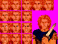 | `KING13` | [CIVDATA2 #513](../assets-extracted/tiles/CIVDATA2_513_KING13.png) | 427×320 |

## Units (32)

### 單位 sprite (32)

| Sprite | Name | Resource | Size |
|---|---|---|---|
|  | `ARMOR` | [Civdata3 #1211](../assets-extracted/tiles/Civdata3_1211_ARMOR.png) | 215×100 |
|  | `ARTILLER` | [Civdata3 #1212](../assets-extracted/tiles/Civdata3_1212_ARTILLER.png) | 215×100 |
|  | `BATTLESH` | [Civdata3 #1221](../assets-extracted/tiles/Civdata3_1221_BATTLESH.png) | 215×100 |
|  | `BOMBER` | [Civdata3 #1215](../assets-extracted/tiles/Civdata3_1215_BOMBER.png) | 215×100 |
|  | `CANNON` | [Civdata3 #1209](../assets-extracted/tiles/Civdata3_1209_CANNON.png) | 215×100 |
|  | `CARAVAN` | [Civdata3 #1227](../assets-extracted/tiles/Civdata3_1227_CARAVAN.png) | 215×100 |
|  | `CARRIER` | [Civdata3 #1223](../assets-extracted/tiles/Civdata3_1223_CARRIER.png) | 215×100 |
|  | `CATAPULT` | [Civdata3 #1208](../assets-extracted/tiles/Civdata3_1208_CATAPULT.png) | 215×100 |
|  | `CAVALRY` | [Civdata3 #1206](../assets-extracted/tiles/Civdata3_1206_CAVALRY.png) | 215×100 |
|  | `CHARIOT` | [Civdata3 #1210](../assets-extracted/tiles/Civdata3_1210_CHARIOT.png) | 215×100 |
|  | `CRUISER` | [Civdata3 #1220](../assets-extracted/tiles/Civdata3_1220_CRUISER.png) | 215×100 |
|  | `DIPLOMAT` | [Civdata3 #1226](../assets-extracted/tiles/Civdata3_1226_DIPLOMAT.png) | 215×100 |
|  | `FIGHTER` | [Civdata3 #1214](../assets-extracted/tiles/Civdata3_1214_FIGHTER.png) | 215×100 |
|  | `FRIGATE` | [Civdata3 #1218](../assets-extracted/tiles/Civdata3_1218_FRIGATE.png) | 215×100 |
| 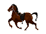 | `HORSE` | [Civdata3 #1131](../assets-extracted/tiles/Civdata3_1131_HORSE.png) | 178×132 |
| 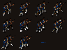 | `INVADER2` | [Civdata3 #3345](../assets-extracted/tiles/Civdata3_3345_INVADER2.png) | 512×384 |
| 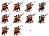 | `INVADER3` | [Civdata3 #3346](../assets-extracted/tiles/Civdata3_3346_INVADER3.png) | 512×384 |
| 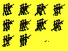 | `INVADERS` | [Civdata3 #3344](../assets-extracted/tiles/Civdata3_3344_INVADERS.png) | 512×384 |
|  | `IRONCLAD` | [Civdata3 #1219](../assets-extracted/tiles/Civdata3_1219_IRONCLAD.png) | 215×100 |
|  | `KNIGHT` | [Civdata3 #1207](../assets-extracted/tiles/Civdata3_1207_KNIGHT.png) | 215×100 |
|  | `LEGION` | [Civdata3 #1203](../assets-extracted/tiles/Civdata3_1203_LEGION.png) | 215×100 |
|  | `MECHINF` | [Civdata3 #1213](../assets-extracted/tiles/Civdata3_1213_MECHINF.png) | 215×100 |
|  | `MILITIA` | [Civdata3 #1201](../assets-extracted/tiles/Civdata3_1201_MILITIA.png) | 215×100 |
|  | `MUSKETEE` | [Civdata3 #1204](../assets-extracted/tiles/Civdata3_1204_MUSKETEE.png) | 215×100 |
| 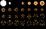 | `NUKE1` | [Civdata0 #144](../assets-extracted/tiles/Civdata0_144_NUKE1.png) | 640×400 |
|  | `PHALANX` | [Civdata3 #1202](../assets-extracted/tiles/Civdata3_1202_PHALANX.png) | 215×100 |
|  | `RIFLEMEN` | [Civdata3 #1205](../assets-extracted/tiles/Civdata3_1205_RIFLEMEN.png) | 215×100 |
|  | `SETTLERS` | [Civdata3 #1200](../assets-extracted/tiles/Civdata3_1200_SETTLERS.png) | 215×100 |
| 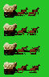 | `SETTLERS` | [Civdata3 #3347](../assets-extracted/tiles/Civdata3_3347_SETTLERS.png) | 80×125 |
|  | `SUBMARIN` | [Civdata3 #1222](../assets-extracted/tiles/Civdata3_1222_SUBMARIN.png) | 215×100 |
|  | `TRANSPOR` | [Civdata3 #1224](../assets-extracted/tiles/Civdata3_1224_TRANSPOR.png) | 215×100 |
|  | `TRIREME` | [Civdata3 #1216](../assets-extracted/tiles/Civdata3_1216_TRIREME.png) | 215×100 |

## Technology (67)

### 科技 icon (67)

| Sprite | Name | Resource | Size |
|---|---|---|---|
|  | `ADVFLGHT` | [Civdata3 #1139](../assets-extracted/tiles/Civdata3_1139_ADVFLGHT.png) | 178×132 |
|  | `ALPHABET` | [Civdata3 #1100](../assets-extracted/tiles/Civdata3_1100_ALPHABET.png) | 178×132 |
|  | `ASTRONOM` | [Civdata3 #1106](../assets-extracted/tiles/Civdata3_1106_ASTRONOM.png) | 178×132 |
|  | `ATOMIC` | [Civdata3 #1103](../assets-extracted/tiles/Civdata3_1103_ATOMIC.png) | 178×132 |
|  | `AUTO` | [Civdata3 #1158](../assets-extracted/tiles/Civdata3_1158_AUTO.png) | 178×132 |
|  | `BANKING` | [Civdata3 #1153](../assets-extracted/tiles/Civdata3_1153_BANKING.png) | 178×132 |
|  | `BRIDGE` | [Civdata3 #1119](../assets-extracted/tiles/Civdata3_1119_BRIDGE.png) | 178×132 |
|  | `BRONZE` | [Civdata3 #1117](../assets-extracted/tiles/Civdata3_1117_BRONZE.png) | 178×132 |
|  | `BURIAL` | [Civdata3 #1125](../assets-extracted/tiles/Civdata3_1125_BURIAL.png) | 178×132 |
| 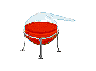 | `CHEMISTR` | [Civdata3 #1136](../assets-extracted/tiles/Civdata3_1136_CHEMISTR.png) | 178×132 |
|  | `CHIVALRY` | [Civdata3 #1162](../assets-extracted/tiles/Civdata3_1162_CHIVALRY.png) | 178×132 |
|  | `CODELAW` | [Civdata3 #1101](../assets-extracted/tiles/Civdata3_1101_CODELAW.png) | 178×132 |
| 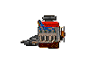 | `COMBUSTI` | [Civdata3 #1137](../assets-extracted/tiles/Civdata3_1137_COMBUSTI.png) | 178×132 |
|  | `COMMIE` | [Civdata3 #1143](../assets-extracted/tiles/Civdata3_1143_COMMIE.png) | 178×132 |
|  | `COMPUTER` | [Civdata3 #1121](../assets-extracted/tiles/Civdata3_1121_COMPUTER.png) | 178×132 |
|  | `CONSCRIP` | [Civdata3 #1164](../assets-extracted/tiles/Civdata3_1164_CONSCRIP.png) | 178×132 |
|  | `CONSTRUC` | [Civdata3 #1145](../assets-extracted/tiles/Civdata3_1145_CONSTRUC.png) | 178×132 |
|  | `CORPORAT` | [Civdata3 #1147](../assets-extracted/tiles/Civdata3_1147_CORPORAT.png) | 178×132 |
|  | `CURRENCY` | [Civdata3 #1102](../assets-extracted/tiles/Civdata3_1102_CURRENCY.png) | 178×132 |
|  | `DEMOCRAC` | [Civdata3 #1104](../assets-extracted/tiles/Civdata3_1104_DEMOCRAC.png) | 178×132 |
|  | `ELECTRIC` | [Civdata3 #1154](../assets-extracted/tiles/Civdata3_1154_ELECTRIC.png) | 178×132 |
| 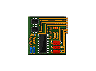 | `ELECTRON` | [Civdata3 #1115](../assets-extracted/tiles/Civdata3_1115_ELECTRON.png) | 178×132 |
| 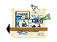 | `ENGINEER` | [Civdata3 #1112](../assets-extracted/tiles/Civdata3_1112_ENGINEER.png) | 178×132 |
|  | `EXPLOSIV` | [Civdata3 #1156](../assets-extracted/tiles/Civdata3_1156_EXPLOSIV.png) | 178×132 |
| 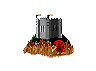 | `FEUDAL` | [Civdata3 #1132](../assets-extracted/tiles/Civdata3_1132_FEUDAL.png) | 178×132 |
|  | `FISSION` | [Civdata3 #1127](../assets-extracted/tiles/Civdata3_1127_FISSION.png) | 178×132 |
|  | `FLIGHT` | [Civdata3 #1138](../assets-extracted/tiles/Civdata3_1138_FLIGHT.png) | 178×132 |
|  | `FUSION` | [Civdata3 #1166](../assets-extracted/tiles/Civdata3_1166_FUSION.png) | 178×132 |
| 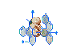 | `GENETIC` | [Civdata3 #1159](../assets-extracted/tiles/Civdata3_1159_GENETIC.png) | 178×132 |
| 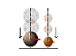 | `GRAVITY` | [Civdata3 #1151](../assets-extracted/tiles/Civdata3_1151_GRAVITY.png) | 178×132 |
| 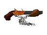 | `GUNPOWDE` | [Civdata3 #1134](../assets-extracted/tiles/Civdata3_1134_GUNPOWDE.png) | 178×132 |
|  | `INDUSTRI` | [Civdata3 #1135](../assets-extracted/tiles/Civdata3_1135_INDUSTRI.png) | 178×132 |
|  | `INVENTIO` | [Civdata3 #1120](../assets-extracted/tiles/Civdata3_1120_INVENTIO.png) | 178×132 |
| 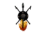 | `IRON` | [Civdata3 #1118](../assets-extracted/tiles/Civdata3_1118_IRON.png) | 178×132 |
|  | `LITERACY` | [Civdata3 #1130](../assets-extracted/tiles/Civdata3_1130_LITERACY.png) | 178×132 |
| 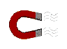 | `MAGNET` | [Civdata3 #1114](../assets-extracted/tiles/Civdata3_1114_MAGNET.png) | 178×132 |
|  | `MASONRY` | [Civdata3 #1116](../assets-extracted/tiles/Civdata3_1116_MASONRY.png) | 178×132 |
|  | `MASSPROD` | [Civdata3 #1141](../assets-extracted/tiles/Civdata3_1141_MASSPROD.png) | 178×132 |
| 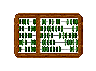 | `MATH` | [Civdata3 #1109](../assets-extracted/tiles/Civdata3_1109_MATH.png) | 178×132 |
|  | `MEDICINE` | [Civdata3 #1110](../assets-extracted/tiles/Civdata3_1110_MEDICINE.png) | 178×132 |
|  | `METALLUR` | [Civdata3 #1148](../assets-extracted/tiles/Civdata3_1148_METALLUR.png) | 178×132 |
|  | `MONARCHY` | [Civdata3 #1105](../assets-extracted/tiles/Civdata3_1105_MONARCHY.png) | 178×132 |
|  | `MYSTIC` | [Civdata3 #1126](../assets-extracted/tiles/Civdata3_1126_MYSTIC.png) | 178×132 |
|  | `NAVIGATI` | [Civdata3 #1108](../assets-extracted/tiles/Civdata3_1108_NAVIGATI.png) | 178×132 |
|  | `NUCLEAR` | [Civdata3 #1150](../assets-extracted/tiles/Civdata3_1150_NUCLEAR.png) | 178×132 |
|  | `NUCLEAR` | [Civdata3 #1225](../assets-extracted/tiles/Civdata3_1225_NUCLEAR.png) | 215×100 |
|  | `PHILOSOP` | [Civdata3 #1128](../assets-extracted/tiles/Civdata3_1128_PHILOSOP.png) | 178×132 |
| 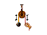 | `PHYSICS` | [Civdata3 #1111](../assets-extracted/tiles/Civdata3_1111_PHYSICS.png) | 178×132 |
|  | `PLASTIC` | [Civdata3 #1160](../assets-extracted/tiles/Civdata3_1160_PLASTIC.png) | 178×132 |
|  | `POP` | [Civdata3 #3339](../assets-extracted/tiles/Civdata3_3339_POP.png) | 512×216 |
|  | `RAILROAD` | [Civdata3 #1149](../assets-extracted/tiles/Civdata3_1149_RAILROAD.png) | 178×132 |
|  | `RECYCLE` | [Civdata3 #1161](../assets-extracted/tiles/Civdata3_1161_RECYCLE.png) | 178×132 |
|  | `REFINING` | [Civdata3 #1155](../assets-extracted/tiles/Civdata3_1155_REFINING.png) | 178×132 |
|  | `RELIGION` | [Civdata3 #1129](../assets-extracted/tiles/Civdata3_1129_RELIGION.png) | 178×132 |
|  | `REPUBLIC` | [Civdata3 #1144](../assets-extracted/tiles/Civdata3_1144_REPUBLIC.png) | 178×132 |
|  | `ROBOT` | [Civdata3 #1163](../assets-extracted/tiles/Civdata3_1163_ROBOT.png) | 178×132 |
| 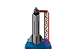 | `ROCKETRY` | [Civdata3 #1146](../assets-extracted/tiles/Civdata3_1146_ROCKETRY.png) | 178×132 |
|  | `SAIL` | [Civdata3 #1217](../assets-extracted/tiles/Civdata3_1217_SAIL.png) | 215×100 |
|  | `SPACE` | [Civdata3 #1140](../assets-extracted/tiles/Civdata3_1140_SPACE.png) | 178×132 |
|  | `STEAM` | [Civdata3 #1123](../assets-extracted/tiles/Civdata3_1123_STEAM.png) | 178×132 |
|  | `STEEL` | [Civdata3 #1152](../assets-extracted/tiles/Civdata3_1152_STEEL.png) | 178×132 |
| 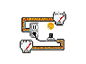 | `SUPERCON` | [Civdata3 #1157](../assets-extracted/tiles/Civdata3_1157_SUPERCON.png) | 178×132 |
|  | `TRADE` | [Civdata3 #1124](../assets-extracted/tiles/Civdata3_1124_TRADE.png) | 178×132 |
|  | `UNION` | [Civdata3 #1165](../assets-extracted/tiles/Civdata3_1165_UNION.png) | 178×132 |
|  | `UNIVERSI` | [Civdata3 #1113](../assets-extracted/tiles/Civdata3_1113_UNIVERSI.png) | 178×132 |
| 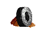 | `WHEEL` | [Civdata3 #1133](../assets-extracted/tiles/Civdata3_1133_WHEEL.png) | 178×132 |
| 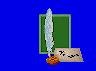 | `WRITING` | [Civdata3 #1122](../assets-extracted/tiles/Civdata3_1122_WRITING.png) | 178×132 |

## Wonders & Buildings (6)

### 建築 / 奇蹟 (6)

| Sprite | Name | Resource | Size |
|---|---|---|---|
| 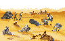 | `ARCH` | [CIVDATA2 #5590](../assets-extracted/tiles/CIVDATA2_5590_ARCH.png) | 512×320 |
|  | `CITYPIX2` | [Civdata3 #3335](../assets-extracted/tiles/Civdata3_3335_CITYPIX2.png) | 480×320 |
|  | `CITYPIX3` | [Civdata3 #3336](../assets-extracted/tiles/Civdata3_3336_CITYPIX3.png) | 480×320 |
| 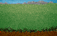 | `HILL` | [Civdata3 #3333](../assets-extracted/tiles/Civdata3_3333_HILL.png) | 512×320 |
|  | `HOUSE` | [Civdata3 #3337](../assets-extracted/tiles/Civdata3_3337_HOUSE.png) | 512×103 |
|  | `WONDERS` | [Civdata3 #3334](../assets-extracted/tiles/Civdata3_3334_WONDERS.png) | 512×485 |

## Government (3)

### 政府型態 (3)

| Sprite | Name | Resource | Size |
|---|---|---|---|
|  | `GOVT0M` | [CIVDATA2 #404](../assets-extracted/tiles/CIVDATA2_404_GOVT0M.png) | 939×320 |
|  | `GOVT1M` | [CIVDATA2 #405](../assets-extracted/tiles/CIVDATA2_405_GOVT1M.png) | 939×320 |
|  | `GOVT2M` | [CIVDATA2 #406](../assets-extracted/tiles/CIVDATA2_406_GOVT2M.png) | 939×320 |

## Space race (11)

### Planet sprites (10)

| Sprite | Name | Resource | Size |
|---|---|---|---|
| 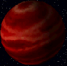 | `planet0` | [CIVDATA2 #5557](../assets-extracted/tiles/CIVDATA2_5557_planet0.png) | 116×113 |
|  | `planet1` | [CIVDATA2 #5558](../assets-extracted/tiles/CIVDATA2_5558_planet1.png) | 116×113 |
| 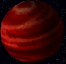 | `planet2` | [CIVDATA2 #5559](../assets-extracted/tiles/CIVDATA2_5559_planet2.png) | 116×113 |
|  | `planet3` | [CIVDATA2 #5560](../assets-extracted/tiles/CIVDATA2_5560_planet3.png) | 116×113 |
| 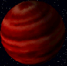 | `planet4` | [CIVDATA2 #5561](../assets-extracted/tiles/CIVDATA2_5561_planet4.png) | 116×113 |
| 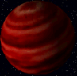 | `planet5` | [CIVDATA2 #5562](../assets-extracted/tiles/CIVDATA2_5562_planet5.png) | 116×113 |
| 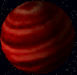 | `planet6` | [CIVDATA2 #5563](../assets-extracted/tiles/CIVDATA2_5563_planet6.png) | 116×113 |
| 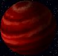 | `planet7` | [CIVDATA2 #5564](../assets-extracted/tiles/CIVDATA2_5564_planet7.png) | 116×113 |
| 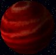 | `planet8` | [CIVDATA2 #5565](../assets-extracted/tiles/CIVDATA2_5565_planet8.png) | 116×113 |
|  | `planet9` | [CIVDATA2 #5566](../assets-extracted/tiles/CIVDATA2_5566_planet9.png) | 116×113 |

### 太空 (1)

| Sprite | Name | Resource | Size |
|---|---|---|---|
|  | `SPACEST` | [CIVDATA2 #5556](../assets-extracted/tiles/CIVDATA2_5556_SPACEST.png) | 512×320 |

## World tiles (16)

### Road / 道路 (5)

| Sprite | Name | Resource | Size |
|---|---|---|---|
|  | `ROAD` | [Civdata3 #3338](../assets-extracted/tiles/Civdata3_3338_ROAD.png) | 307×52 |
|  | `road0` | [Civdata3 #4447](../assets-extracted/tiles/Civdata3_4447_road0.png) | 512×104 |
|  | `road1` | [Civdata3 #4448](../assets-extracted/tiles/Civdata3_4448_road1.png) | 512×104 |
|  | `road2` | [Civdata3 #4449](../assets-extracted/tiles/Civdata3_4449_road2.png) | 512×104 |
|  | `road3` | [Civdata3 #4450](../assets-extracted/tiles/Civdata3_4450_road3.png) | 512×104 |

### 裝飾元素 (城牆 / 樹 / 雕像 / 天空) (11)

| Sprite | Name | Resource | Size |
|---|---|---|---|
|  | `basestrip` | [Civdata3 #4446](../assets-extracted/tiles/Civdata3_4446_basestrip.png) | 512×5 |
|  | `leftbush` | [Civdata3 #4451](../assets-extracted/tiles/Civdata3_4451_leftbush.png) | 224×108 |
|  | `leftstatue` | [Civdata3 #4455](../assets-extracted/tiles/Civdata3_4455_leftstatue.png) | 291×146 |
|  | `lefttree` | [Civdata3 #4453](../assets-extracted/tiles/Civdata3_4453_lefttree.png) | 259×111 |
|  | `pottery` | [Civdata3 #1142](../assets-extracted/tiles/Civdata3_1142_pottery.png) | 178×132 |
|  | `rightbush` | [Civdata3 #4452](../assets-extracted/tiles/Civdata3_4452_rightbush.png) | 218×80 |
|  | `rightstatue` | [Civdata3 #4456](../assets-extracted/tiles/Civdata3_4456_rightstatue.png) | 217×143 |
|  | `righttree` | [Civdata3 #4454](../assets-extracted/tiles/Civdata3_4454_righttree.png) | 218×88 |
|  | `sky0` | [Civdata3 #4444](../assets-extracted/tiles/Civdata3_4444_sky0.png) | 512×211 |
|  | `sky1` | [Civdata3 #4445](../assets-extracted/tiles/Civdata3_4445_sky1.png) | 512×211 |
|  | `starrynight` | [CIVDATA2 #5555](../assets-extracted/tiles/CIVDATA2_5555_starrynight.png) | 512×320 |

## Animations (20)

### City castle 動畫 (5×3) (13)

| Sprite | Name | Resource | Size |
|---|---|---|---|
|  | `castle0a` | [Civdata3 #4457](../assets-extracted/tiles/Civdata3_4457_castle0a.png) | 256×160 |
|  | `castle1a` | [Civdata3 #4458](../assets-extracted/tiles/Civdata3_4458_castle1a.png) | 256×160 |
|  | `castle1b` | [Civdata3 #4459](../assets-extracted/tiles/Civdata3_4459_castle1b.png) | 256×160 |
|  | `castle1c` | [Civdata3 #4460](../assets-extracted/tiles/Civdata3_4460_castle1c.png) | 280×160 |
|  | `castle2a` | [Civdata3 #4461](../assets-extracted/tiles/Civdata3_4461_castle2a.png) | 256×160 |
|  | `castle2b` | [Civdata3 #4462](../assets-extracted/tiles/Civdata3_4462_castle2b.png) | 256×160 |
|  | `castle2c` | [Civdata3 #4463](../assets-extracted/tiles/Civdata3_4463_castle2c.png) | 280×160 |
|  | `castle3a` | [Civdata3 #4464](../assets-extracted/tiles/Civdata3_4464_castle3a.png) | 256×160 |
|  | `castle3b` | [Civdata3 #4465](../assets-extracted/tiles/Civdata3_4465_castle3b.png) | 256×160 |
|  | `castle3c` | [Civdata3 #4466](../assets-extracted/tiles/Civdata3_4466_castle3c.png) | 280×160 |
|  | `castle4a` | [Civdata3 #4467](../assets-extracted/tiles/Civdata3_4467_castle4a.png) | 256×160 |
|  | `castle4b` | [Civdata3 #4468](../assets-extracted/tiles/Civdata3_4468_castle4b.png) | 256×160 |
|  | `castle4c` | [Civdata3 #4469](../assets-extracted/tiles/Civdata3_4469_castle4c.png) | 280×160 |

### 文明誕生開場 (Small_Birth) (7)

| Sprite | Name | Resource | Size |
|---|---|---|---|
|  | `Small_Birth_2` | [Civdata3 #5000](../assets-extracted/tiles/Civdata3_5000_Small_Birth_2.png) | 300×115 |
|  | `Small_Birth_3` | [Civdata3 #5001](../assets-extracted/tiles/Civdata3_5001_Small_Birth_3.png) | 300×115 |
|  | `Small_Birth_4` | [Civdata3 #5002](../assets-extracted/tiles/Civdata3_5002_Small_Birth_4.png) | 300×115 |
|  | `Small_Birth_5` | [Civdata3 #5003](../assets-extracted/tiles/Civdata3_5003_Small_Birth_5.png) | 300×115 |
|  | `Small_Birth_6` | [Civdata3 #5004](../assets-extracted/tiles/Civdata3_5004_Small_Birth_6.png) | 300×115 |
|  | `Small_Birth_7` | [Civdata3 #5005](../assets-extracted/tiles/Civdata3_5005_Small_Birth_7.png) | 300×115 |
|  | `Small_Birth_8` | [Civdata3 #5006](../assets-extracted/tiles/Civdata3_5006_Small_Birth_8.png) | 300×115 |

## UI (10)

### 對話 / 選單 / 狀態 (10)

| Sprite | Name | Resource | Size |
|---|---|---|---|
|  | `DIFFS` | [Civdata3 #141](../assets-extracted/tiles/Civdata3_141_DIFFS.png) | 512×320 |
| 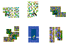 | `ICONPGT1` | [Civdata3 #1013](../assets-extracted/tiles/Civdata3_1013_ICONPGT1.png) | 427×320 |
| 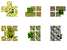 | `ICONPGT2` | [Civdata3 #1014](../assets-extracted/tiles/Civdata3_1014_ICONPGT2.png) | 427×320 |
| 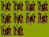 | `LOVE1` | [Civdata3 #3340](../assets-extracted/tiles/Civdata3_3340_LOVE1.png) | 512×384 |
| 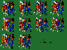 | `LOVE2` | [Civdata3 #3341](../assets-extracted/tiles/Civdata3_3341_LOVE2.png) | 512×384 |
|  | `MAP` | [Civdata3 #1107](../assets-extracted/tiles/Civdata3_1107_MAP.png) | 178×132 |
| 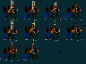 | `RIOT` | [Civdata3 #3342](../assets-extracted/tiles/Civdata3_3342_RIOT.png) | 512×384 |
| 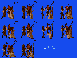 | `RIOT2` | [Civdata3 #3343](../assets-extracted/tiles/Civdata3_3343_RIOT2.png) | 512×384 |
|  | `fame` | [Civdata3 #5600](../assets-extracted/tiles/Civdata3_5600_fame.png) | 512×320 |
|  | `slamall` | [CIVDATA2 #5591](../assets-extracted/tiles/CIVDATA2_5591_slamall.png) | 645×320 |

## Special (6)

### 特殊 (主 sprite sheet / 工具 / 截圖) (6)

| Sprite | Name | Resource | Size |
|---|---|---|---|
|  | `DOCKER` | [Civdata0 #5581](../assets-extracted/tiles/Civdata0_5581_DOCKER.png) | 48×360 |
|  | `EARTH` | [Civdata0 #137](../assets-extracted/tiles/Civdata0_137_EARTH.png) | 320×200 |
|  | `SPR32X32` | [CIVDATA4 #200](../assets-extracted/tiles/CIVDATA4_200_SPR32X32.png) | 1472×400 |
|  | `SPY` | [Civdata0 #202](../assets-extracted/tiles/Civdata0_202_SPY.png) | 243×116 |
|  | `discovr1` | [Civdata3 #142](../assets-extracted/tiles/Civdata3_142_discovr1.png) | 512×320 |
|  | `discovr2` | [Civdata3 #143](../assets-extracted/tiles/Civdata3_143_discovr2.png) | 512×320 |
